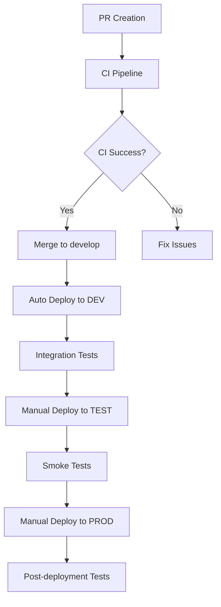

# GitHub Actions CI/CD Implementation Guide

Este documento proporciona una guía completa para implementar GitHub Actions como sistema de CI/CD para el proyecto GCP Hello World Infrastructure.

## 🏗️ Arquitectura CI/CD

### Estructura de Workflows

```
.github/workflows/
├── ci.yml              # Integración continua (PR + develop)
├── deploy-dev.yml      # Despliegue automático a DEV
├── deploy-test.yml     # Despliegue manual a TEST
├── deploy-prod.yml     # Despliegue manual a PROD
└── cleanup.yml         # Limpieza de recursos
```

### Flujo de Trabajo



## 🔧 Configuración Inicial

### 1. Secrets de GitHub

Configure los siguientes secrets en el repositorio:

#### GCP Service Account Keys
```bash
# Development
GCP_SA_KEY_DEV          # Service Account JSON key for DEV
GCP_PROJECT_ID_DEV      # GCP Project ID for DEV

# Test
GCP_SA_KEY_TEST         # Service Account JSON key for TEST
GCP_PROJECT_ID_TEST     # GCP Project ID for TEST

# Production
GCP_SA_KEY_PROD         # Service Account JSON key for PROD
GCP_PROJECT_ID_PROD     # GCP Project ID for PROD
```

#### Additional Secrets
```bash
INFRACOST_API_KEY       # Para estimación de costos (opcional)
PROD_APPROVERS          # Lista de usuarios para aprobar PROD
```

### 2. Creación de Service Accounts

Para cada ambiente, crear un Service Account con los permisos necesarios:

```bash
# Crear Service Account
gcloud iam service-accounts create github-actions-sa \
  --display-name="GitHub Actions Service Account" \
  --project=YOUR_PROJECT_ID

# Asignar roles necesarios
gcloud projects add-iam-policy-binding YOUR_PROJECT_ID \
  --member="serviceAccount:github-actions-sa@YOUR_PROJECT_ID.iam.gserviceaccount.com" \
  --role="roles/compute.admin"

gcloud projects add-iam-policy-binding YOUR_PROJECT_ID \
  --member="serviceAccount:github-actions-sa@YOUR_PROJECT_ID.iam.gserviceaccount.com" \
  --role="roles/cloudfunctions.admin"

gcloud projects add-iam-policy-binding YOUR_PROJECT_ID \
  --member="serviceAccount:github-actions-sa@YOUR_PROJECT_ID.iam.gserviceaccount.com" \
  --role="roles/storage.admin"

gcloud projects add-iam-policy-binding YOUR_PROJECT_ID \
  --member="serviceAccount:github-actions-sa@YOUR_PROJECT_ID.iam.gserviceaccount.com" \
  --role="roles/iam.serviceAccountUser"

# Generar key JSON
gcloud iam service-accounts keys create github-actions-key.json \
  --iam-account=github-actions-sa@YOUR_PROJECT_ID.iam.gserviceaccount.com
```

### 3. Configuración de Terraform Backend

Para cada ambiente, configure un backend remoto:

```hcl
# environments/dev/backend.tf
terraform {
  backend "gcs" {
    bucket = "your-project-terraform-state-dev"
    prefix = "dev/terraform/state"
  }
}
```

## 📋 Workflows Detallados

### 1. CI Pipeline (`ci.yml`)

**Triggers:**
- Pull Requests a `main` o `develop`
- Push a `develop`

**Jobs:**
- **validate**: Validación y linting de Terraform
- **security-scan**: Escaneo de seguridad con Checkov y TFSec
- **unit-tests**: Pruebas unitarias en Go y Python
- **plan**: Terraform plan para DEV y TEST
- **cost-estimation**: Estimación de costos con Infracost

### 2. Deploy Development (`deploy-dev.yml`)

**Triggers:**
- Push a `develop`
- Manual dispatch

**Jobs:**
- **deploy**: Despliegue automático a DEV
- **integration-tests**: Pruebas de integración con Terratest

### 3. Deploy Test (`deploy-test.yml`)

**Triggers:**
- Manual dispatch únicamente

**Features:**
- Confirmación requerida ("deploy")
- Validación de entrada
- Smoke tests post-despliegue

### 4. Deploy Production (`deploy-prod.yml`)

**Triggers:**
- Manual dispatch únicamente

**Features:**
- Validación de tag de versión
- Confirmación requerida ("PRODUCTION")
- Escaneo de seguridad obligatorio
- Aprobación manual de múltiples usuarios
- Health checks extensivos
- Pruebas post-despliegue

### 5. Cleanup Resources (`cleanup.yml`)

**Triggers:**
- Manual dispatch únicamente

**Features:**
- Destrucción de recursos para DEV y TEST
- Confirmación requerida ("DESTROY")
- Protección contra limpieza de PROD

## 🔒 Características de Seguridad

### Security Scanning
- **Checkov**: Escaneo de configuración de Terraform
- **TFSec**: Análisis de seguridad específico para Terraform
- **SARIF Upload**: Integración con GitHub Security tab

### Access Control
- **Environment Protection**: Reglas de protección por ambiente
- **Manual Approvals**: Aprobaciones requeridas para PROD
- **Secret Management**: Gestión segura de credenciales

### Compliance
- **Audit Trail**: Registro completo de despliegues
- **Change Management**: Proceso controlado para PROD
- **Rollback Strategy**: Capacidad de rollback via tags

## 🧪 Estrategia de Testing

### Niveles de Testing

1. **Unit Tests**: Validación de lógica de negocio
2. **Integration Tests**: Pruebas de infraestructura con Terratest
3. **Smoke Tests**: Verificación básica de endpoints
4. **Health Checks**: Monitoreo de servicios desplegados

### Test Coverage

```bash
# Terraform Validation
terraform validate
terraform fmt -check

# Go Unit Tests
go test -v -run TestHelloWorldFunctionUnit

# Integration Tests
go test -v -run TestHelloWorld -timeout 30m

# Python Tests
python -m pytest modules/cloud_function/
```

## 🚀 Proceso de Despliegue

### Development Flow
1. Crear feature branch
2. Desarrollar y commit cambios
3. Crear Pull Request
4. CI pipeline ejecuta validaciones
5. Merge a `develop`
6. Auto-deploy a DEV
7. Integration tests

### Production Flow
1. Merge `develop` a `main`
2. Crear release tag
3. Ejecutar deployment a TEST
4. Validar en TEST
5. Ejecutar deployment a PROD
6. Aprobar deployment
7. Post-deployment tests

## 📊 Monitoreo y Alertas

### GitHub Actions Monitoring
- **Workflow Status**: Dashboard de estados
- **Deployment History**: Historial de despliegues
- **Failed Deployments**: Alertas de fallos

### GCP Monitoring
- **Function Metrics**: Métricas de Cloud Functions
- **Load Balancer Health**: Estado del Load Balancer
- **Security Events**: Eventos de Cloud Armor

## 🔄 Rollback Strategy

### Automatic Rollback
- Health checks fallan → Rollback automático
- Integration tests fallan → Prevenir despliegue

### Manual Rollback
```bash
# Rollback to previous version
git tag -l | grep -E '^v[0-9]+\.[0-9]+\.[0-9]+$' | sort -V | tail -2 | head -1
# Execute deployment with previous tag
```

## 📈 Métricas y KPIs

### Deployment Metrics
- **Deployment Frequency**: Frecuencia de despliegues
- **Lead Time**: Tiempo desde commit hasta producción
- **Mean Time to Recovery (MTTR)**: Tiempo de recuperación
- **Change Failure Rate**: Tasa de fallos

### Quality Metrics
- **Test Coverage**: Cobertura de pruebas
- **Security Scan Pass Rate**: Tasa de éxito de escaneos
- **Infrastructure Drift**: Detección de cambios no controlados

## 🛠️ Troubleshooting

### Common Issues

#### 1. Authentication Errors
```bash
# Verificar Service Account permissions
gcloud projects get-iam-policy YOUR_PROJECT_ID \
  --filter="bindings.members:serviceAccount:github-actions-sa@YOUR_PROJECT_ID.iam.gserviceaccount.com"
```

#### 2. Terraform State Issues
```bash
# Verificar estado remoto
gsutil ls gs://your-terraform-state-bucket/
```

#### 3. API Enablement
```bash
# Verificar APIs habilitadas
gcloud services list --enabled --project=YOUR_PROJECT_ID
```

## 🎯 Best Practices

### 1. Branch Strategy
- `main`: Código estable para producción
- `develop`: Integración continua
- `feature/*`: Desarrollo de características
- `hotfix/*`: Correcciones urgentes

### 2. Environment Parity
- Mantener configuraciones similares entre ambientes
- Usar variables de ambiente para diferencias
- Documentar diferencias específicas

### 3. Secret Management
- Rotar secrets regularmente
- Usar principio de menor privilegio
- Auditar acceso a secrets

### 4. Testing Strategy
- Tests en cada nivel del pipeline
- Fail fast principle
- Cobertura de tests > 80%

## 📚 Referencias

- [GitHub Actions Documentation](https://docs.github.com/en/actions)
- [Terraform Best Practices](https://www.terraform.io/docs/cloud/guides/recommended-practices/index.html)
- [GCP Service Account Best Practices](https://cloud.google.com/iam/docs/service-accounts)
- [Terratest Documentation](https://terratest.gruntwork.io/)

## 🤝 Contribución

Para contribuir a la mejora de este CI/CD:

1. Fork del repositorio
2. Crear branch de feature
3. Implementar mejoras
4. Agregar/actualizar tests
5. Crear Pull Request
6. Revisar y aprobar cambios 