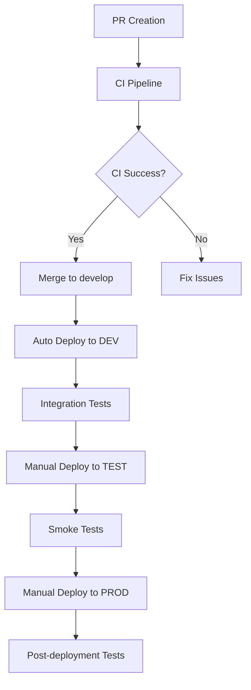

# GitHub Actions CI/CD Implementation Guide

This document provides a comprehensive guide for implementing GitHub Actions as a CI/CD system for the GCP Hello World Infrastructure project.

## 🏗️ CI/CD Architecture

### Workflow Structure

```
.github/workflows/
├── ci.yml              # Continuous integration (PR + develop)
├── deploy-dev.yml      # Automatic deployment to DEV
├── deploy-test.yml     # Manual deployment to TEST
├── deploy-prod.yml     # Manual deployment to PROD
└── cleanup.yml         # Resource cleanup
```

### Workflow Flow



## 🔧 Initial Setup

### 1. GitHub Secrets

Configure the following secrets in the repository:

#### GCP Service Account Keys
```bash
# Development
GCP_SA_KEY_DEV          # Service Account JSON key for DEV
GCP_PROJECT_ID_DEV      # GCP Project ID for DEV

# Test
GCP_SA_KEY_TEST         # Service Account JSON key for TEST
GCP_PROJECT_ID_TEST     # GCP Project ID for TEST

# Production
GCP_SA_KEY_PROD         # Service Account JSON key for PROD
GCP_PROJECT_ID_PROD     # GCP Project ID for PROD
```

#### Additional Secrets
```bash
INFRACOST_API_KEY       # For cost estimation (optional)
PROD_APPROVERS          # List of users to approve PROD
```

### 2. Service Account Creation

For each environment, create a Service Account with the necessary permissions:

```bash
# Create Service Account
gcloud iam service-accounts create github-actions-sa \
  --display-name="GitHub Actions Service Account" \
  --project=YOUR_PROJECT_ID

# Assign necessary roles
gcloud projects add-iam-policy-binding YOUR_PROJECT_ID \
  --member="serviceAccount:github-actions-sa@YOUR_PROJECT_ID.iam.gserviceaccount.com" \
  --role="roles/compute.admin"

gcloud projects add-iam-policy-binding YOUR_PROJECT_ID \
  --member="serviceAccount:github-actions-sa@YOUR_PROJECT_ID.iam.gserviceaccount.com" \
  --role="roles/cloudfunctions.admin"

gcloud projects add-iam-policy-binding YOUR_PROJECT_ID \
  --member="serviceAccount:github-actions-sa@YOUR_PROJECT_ID.iam.gserviceaccount.com" \
  --role="roles/storage.admin"

gcloud projects add-iam-policy-binding YOUR_PROJECT_ID \
  --member="serviceAccount:github-actions-sa@YOUR_PROJECT_ID.iam.gserviceaccount.com" \
  --role="roles/iam.serviceAccountUser"

# Generate JSON key
gcloud iam service-accounts keys create github-actions-key.json \
  --iam-account=github-actions-sa@YOUR_PROJECT_ID.iam.gserviceaccount.com
```

### 3. Terraform Backend Configuration

For each environment, configure a remote backend:

```hcl
# environments/dev/backend.tf
terraform {
  backend "gcs" {
    bucket = "your-project-terraform-state-dev"
    prefix = "dev/terraform/state"
  }
}
```

## 📋 Detailed Workflows

### 1. CI Pipeline (`ci.yml`)

**Triggers:**
- Pull Requests to `main` or `develop`
- Push to `develop`

**Jobs:**
- **validate**: Terraform validation and linting
- **security-scan**: Security scanning with Checkov and TFSec
- **unit-tests**: Unit tests in Go and Python
- **plan**: Terraform plan for DEV and TEST
- **cost-estimation**: Cost estimation with Infracost

### 2. Deploy Development (`deploy-dev.yml`)

**Triggers:**
- Push to `develop`
- Manual dispatch

**Jobs:**
- **deploy**: Automatic deployment to DEV
- **integration-tests**: Integration tests with Terratest

### 3. Deploy Test (`deploy-test.yml`)

**Triggers:**
- Manual dispatch only

**Features:**
- Required confirmation ("deploy")
- Input validation
- Post-deployment smoke tests

### 4. Deploy Production (`deploy-prod.yml`)

**Triggers:**
- Manual dispatch only

**Features:**
- Version tag validation
- Required confirmation ("PRODUCTION")
- Mandatory security scanning
- Multi-user manual approval
- Extensive health checks
- Post-deployment testing

### 5. Cleanup Resources (`cleanup.yml`)

**Triggers:**
- Manual dispatch only

**Features:**
- Resource destruction for DEV and TEST
- Required confirmation ("DESTROY")
- Protection against PROD cleanup

## 🔒 Security Features

### Security Scanning
- **Checkov**: Terraform configuration scanning
- **TFSec**: Terraform-specific security analysis
- **SARIF Upload**: Integration with GitHub Security tab

### Access Control
- **Environment Protection**: Protection rules per environment
- **Manual Approvals**: Required approvals for PROD
- **Secret Management**: Secure credential management

### Compliance
- **Audit Trail**: Complete deployment logging
- **Change Management**: Controlled process for PROD
- **Rollback Strategy**: Rollback capability via tags

## 🧪 Testing Strategy

### Testing Levels

1. **Unit Tests**: Business logic validation
2. **Integration Tests**: Infrastructure testing with Terratest
3. **Smoke Tests**: Basic endpoint verification
4. **Health Checks**: Deployed service monitoring

### Test Coverage

```bash
# Terraform Validation
terraform validate
terraform fmt -check

# Go Unit Tests
go test -v -run TestHelloWorldFunctionUnit

# Integration Tests
go test -v -run TestHelloWorld -timeout 30m

# Python Tests
python -m pytest modules/cloud_function/
```

## 🚀 Deployment Process

### Development Flow
1. Create feature branch
2. Develop and commit changes
3. Create Pull Request
4. CI pipeline executes validations
5. Merge to `develop`
6. Auto-deploy to DEV
7. Integration tests

### Production Flow
1. Merge `develop` to `main`
2. Create release tag
3. Execute deployment to TEST
4. Validate in TEST
5. Execute deployment to PROD
6. Approve deployment
7. Post-deployment tests

## 📊 Monitoring and Alerts

### GitHub Actions Monitoring
- **Workflow Status**: Status dashboard
- **Deployment History**: Deployment history
- **Failed Deployments**: Failure alerts

### GCP Monitoring
- **Function Metrics**: Cloud Functions metrics
- **Load Balancer Health**: Load Balancer status
- **Security Events**: Cloud Armor events

## 🔄 Rollback Strategy

### Automatic Rollback
- Health checks fail → Automatic rollback
- Integration tests fail → Prevent deployment

### Manual Rollback
```bash
# Rollback to previous version
git tag -l | grep -E '^v[0-9]+\.[0-9]+\.[0-9]+$' | sort -V | tail -2 | head -1
# Execute deployment with previous tag
```

## 📈 Metrics and KPIs

### Deployment Metrics
- **Deployment Frequency**: Deployment frequency
- **Lead Time**: Time from commit to production
- **Mean Time to Recovery (MTTR)**: Recovery time
- **Change Failure Rate**: Failure rate

### Quality Metrics
- **Test Coverage**: Test coverage
- **Security Scan Pass Rate**: Security scan success rate
- **Infrastructure Drift**: Uncontrolled change detection

## 🛠️ Troubleshooting

### Common Issues

#### 1. Authentication Errors
```bash
# Verify Service Account permissions
gcloud projects get-iam-policy YOUR_PROJECT_ID \
  --filter="bindings.members:serviceAccount:github-actions-sa@YOUR_PROJECT_ID.iam.gserviceaccount.com"
```

#### 2. Terraform State Issues
```bash
# Verify remote state
gsutil ls gs://your-terraform-state-bucket/
```

#### 3. API Enablement
```bash
# Verify enabled APIs
gcloud services list --enabled --project=YOUR_PROJECT_ID
```

## 🎯 Best Practices

### 1. Branch Strategy
- `main`: Stable code for production
- `develop`: Continuous integration
- `feature/*`: Feature development
- `hotfix/*`: Urgent fixes

### 2. Environment Parity
- Maintain similar configurations between environments
- Use environment variables for differences
- Document specific differences

### 3. Secret Management
- Rotate secrets regularly
- Use principle of least privilege
- Audit secret access

### 4. Testing Strategy
- Tests at every pipeline level
- Fail fast principle
- Test coverage > 80%

## 📚 References

- [GitHub Actions Documentation](https://docs.github.com/en/actions)
- [Terraform Best Practices](https://www.terraform.io/docs/cloud/guides/recommended-practices/index.html)
- [GCP Service Account Best Practices](https://cloud.google.com/iam/docs/service-accounts)
- [Terratest Documentation](https://terratest.gruntwork.io/)

## 🤝 Contributing

To contribute to improving this CI/CD:

1. Fork the repository
2. Create feature branch
3. Implement improvements
4. Add/update tests
5. Create Pull Request
6. Review and approve changes 